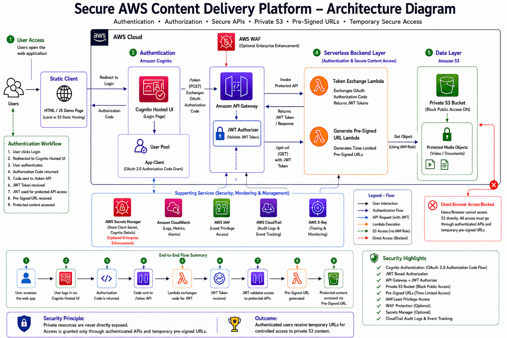

# Secure AWS Content Delivery Platform — Architecture

This architecture illustrates the end-to-end design of the **Secure AWS Content Delivery Platform**, a serverless cloud solution that securely delivers private content stored in Amazon S3 using authentication, authorization, JWT validation, and temporary pre-signed URLs.

The platform ensures that private content is **never directly exposed to users**. Access is granted only after successful authentication and authorization through secure APIs.

---

## Architecture Diagram

---

## Architecture Overview

The platform follows a secure serverless architecture built on AWS services:

### 1. Static Client Layer
A lightweight HTML/JavaScript demo page acts as the client application.

Responsibilities:

- Allows users to initiate login
- Redirects users to Amazon Cognito Hosted UI
- Receives authorization code
- Calls secure backend APIs
- Uses JWT tokens for protected API requests

Hosting:

- Local browser hosting
- Amazon S3 static hosting (optional)

---

### 2. Authentication Layer — Amazon Cognito

Amazon Cognito handles user authentication using:

- User Pool
- App Client
- OAuth 2.0 Authorization Code Flow
- Cognito Hosted UI

Authentication flow:

1. User clicks login
2. User redirected to Cognito Hosted UI
3. User authenticates
4. Authorization code returned

This removes the need to manage passwords directly inside the application.

---

### 3. API Layer — Amazon API Gateway + JWT Authorizer

API Gateway exposes protected endpoints:

**POST /token**

Purpose:

- Accepts OAuth authorization code
- Invokes Lambda function
- Exchanges code for JWT token

**GET /get-url**

Purpose:

- Requires JWT authentication
- Returns temporary pre-signed URLs

JWT Authorizer validates tokens before requests can invoke backend services.

Security benefit:

Unauthorized users cannot execute backend APIs.

---

### 4. Serverless Backend Layer

AWS Lambda provides backend functionality.

Two Lambda functions are used:

### Token Exchange Lambda

Responsibilities:

- Receives OAuth authorization code
- Exchanges code for JWT tokens
- Returns authentication response

### Generate Pre-Signed URL Lambda

Responsibilities:

- Validates access flow
- Uses IAM permissions
- Generates temporary pre-signed URLs
- Grants time-limited access to S3 objects

---

### 5. Secure Data Layer — Amazon S3

Content is stored inside a:

**Private Amazon S3 Bucket**

Security configuration:

- Block Public Access enabled
- Objects inaccessible directly
- Accessible only through temporary URLs

Protected content:

- Videos
- Documents
- Media assets

---

## Direct Browser Access Restriction

Users cannot directly access S3 objects.

Blocked flow:

Browser → Private S3 ❌

Allowed flow:

Browser → Authentication → Protected API → Lambda → Temporary URL → S3 ✅

This follows a core cloud security principle:

> Private resources should never be directly exposed.

---

## Supporting Security Services

### AWS IAM
Implements least privilege permissions.

### CloudWatch
Provides:

- Logs
- Metrics
- Monitoring
- Troubleshooting

### AWS CloudTrail
Tracks:

- API activity
- Audit logs
- Security events

### AWS X-Ray
Provides:

- Request tracing
- Performance monitoring

### Optional Enterprise Enhancements

- AWS WAF
- AWS Secrets Manager

These can be integrated for enterprise-grade protection and secret management.

---

## Security Highlights

✔ OAuth 2.0 Authorization Code Flow  
✔ Cognito Authentication  
✔ JWT-Based Authorization  
✔ API Gateway + JWT Authorizer  
✔ Private S3 Bucket  
✔ Block Public Access Enabled  
✔ Temporary Pre-Signed URLs  
✔ IAM Least Privilege Access  
✔ Audit Logging & Monitoring  
✔ Direct Browser Access Prevention

---

## Security Principle

Private resources are never directly exposed.

Access is granted only through:

- authenticated APIs
- validated JWT tokens
- temporary pre-signed URLs

---

## Final Outcome

Authenticated users receive temporary URLs that provide controlled access to private S3 content without exposing the underlying storage layer.
